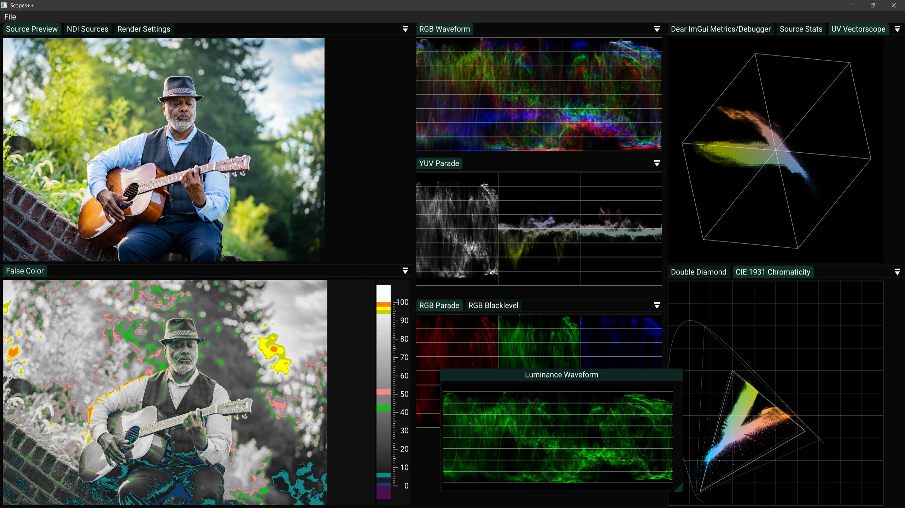

# Scopes++

[](https://cmake.org) [](https://isocpp.org) [](#license) 



**Scopes++** is a work-in-progress native C++23 realtime **waveform**, **vectorscope**, video-analyzer implemented with ImGui, OpenGL and OpenCL. It aims to provide video professionals with a high-performance tool for checking color, exposure, and signal integrity in **live video** streams.

This software is an open-source rework of LiveScopes.tv, which I previously wrote in Dart and C++ with Flutter. The goal of this rework is to solve performance and graphics-API limitations, while also providing it as an open-source project for the community to use and contribute to. The use of ImGui as the GUI framework also allows for a very flexible and user-customizable interface with pop-out windows and docking, which was not possible in the previous Flutter-based implementation.

This project is organized as a standard CMake project and produces a single executable. Runtime assets and OpenCL kernels are copied next to the executable by post-build steps so the binary can be run directly from `build/`.

## Features (WIP)

- [x] Waveforms (Luma, RGB, RGB Parade, RGB Blacklevel, YUV Parade)
- [x] UV Vectorscope
- [x] CIE 1931 Chromaticity
- [x] Double Diamond Scope
- [x] False Color Viewer
- [x] Selectable color spaces (Linear RGB, sRGB, BT.709, BT.601_525, BT.601_625, BT.2020) and legal ranges
- [x] GPU-accelerated image pipeline (OpenGL + OpenCL interop)
- [x] 32-Bit float based processing pipeline
- [x] Customizable & dockable user-interface
- [x] Built-in live test-pattern source
- [x] FFmpeg video-file source
- [x] SRT stream URL input through FFmpeg
- [x] Linux OpenCL 3 build path

## Roadmap

- [ ] Add webcam capture sources
- [ ] Add Blackmagic DeckLink input support
- [ ] Add support for LUTs
- [ ] Add focus peaking
- [ ] Add exposure zebra


## Known issues

- Mismatch between OpenGL and OpenCL device selection when multiple GPUs are present can still cause OpenCL/OpenGL interop failures.
- HLS playlist playback is intentionally disabled in this branch. The current network path is focused on SRT feeds.


## Overview

```
src/
└─ app/
   ├─ src/        # C++ sources
   ├─ assets/     # UI and static assets
   ├─ test/       # Unit tests
   └─ kernels/    # OpenCL kernels
ext/              # External libraries (see below)
docs/screenshots/ # Documentation images
```

## Quickstart (macOS Intel)

```bash
git clone https://github.com/MindStudioOfficial/scopes_plusplus.git
cd scopes_plusplus
cmake -S . -B build-macos
cmake --build build-macos --parallel
./build-macos/src/app/scopes++
```

### Notes for macOS

- The current Apple path targets Intel Macs and builds against the system OpenGL/OpenCL frameworks.
- On Apple builds, NDI is disabled by default in this repository and the app exposes a built-in animated test-pattern source so the renderer and UI remain usable out of the box.
- Apple only exposes OpenCL 1.2, so the build lowers the OpenCL C++ binding target accordingly.

## Quickstart (Linux OpenCL 3)

This branch contains the current Linux OpenCL 3 + FFmpeg port. It uses GLFW/OpenGL for presentation, OpenCL/OpenGL interop for GPU processing, and FFmpeg for local video files plus SRT feeds.

Install the system packages needed by CMake, OpenGL/OpenCL, X11/GLX, and FFmpeg. On Ubuntu/Debian-style systems:

```bash
sudo apt install \
  build-essential cmake git pkg-config \
  libavformat-dev libavcodec-dev libavutil-dev libswscale-dev \
  libgl1-mesa-dev libx11-dev libxrandr-dev libxinerama-dev libxcursor-dev libxi-dev \
  ocl-icd-opencl-dev
```

You also need a working OpenCL runtime for your GPU, such as your vendor driver package. The build fetches Khronos OpenCL headers, but the OpenCL ICD/runtime must come from the system or GPU vendor.

Build and test:

```bash
git clone https://github.com/MindStudioOfficial/scopes_plusplus.git
cd scopes_plusplus
cmake -S . -B build-linux-opencl3-release -DCMAKE_BUILD_TYPE=Release
cmake --build build-linux-opencl3-release --parallel
ctest --test-dir build-linux-opencl3-release --output-on-failure
```

Run with a local file:

```bash
./build-linux-opencl3-release/src/app/scopes++ /absolute/path/video.mp4
```

Run with an SRT feed:

```bash
./build-linux-opencl3-release/src/app/scopes++ 'srt://127.0.0.1:9000?mode=caller&latency=200000'
```

Notes for Linux:

- GLFW is forced to X11/GLX on Linux so OpenCL/OpenGL interop receives GLX handles that match the OpenCL context setup.
- NDI is disabled by default on non-Windows builds.
- HLS URLs and `.m3u`/`.m3u8` playlists are rejected on this branch. SRT is the supported network ingest path.

## Quickstart (Windows)

```powershell
git clone https://github.com/MindStudioOfficial/scopes_plusplus.git
cd scopes_plusplus
cmake -B build
cmake --build build --parallel --config Release
.\build\src\app\Release\scopes++.exe
```

### Notes

- Windows can still optionally build with NDI enabled. The NDI SDK is expected under `ext/ndi`. A post-build step copies `Processing.NDI.Lib.Advanced.x64.dll` to the runtime folder. You need to download the NDI SDK separately from [NDI's website](https://ndi.tv/sdk/) due to licensing restrictions. The expected folder structure is:

```
📂 ext/ndi
├── 📂 include
│   ├── Processing.NDI.Lib.h
│   └── other headers
├── Processing.NDI.Lib.Advanced.x64.dll
├── Processing.NDI.Lib.Advanced.x64.lib
└── Processing.NDI.Lib.License.txt
```

- OpenCL kernels and `assets/` are copied to the build output via CMake post-build steps/targets.
- `SCPP_ENABLE_NDI` defaults to `ON` on Windows and `OFF` on non-Windows platforms.

## Development patterns & conventions

- New source files: place `.cpp` files under `src/app/src` and headers under `src/app/src` (CMake uses `file(GLOB_RECURSE ... CONFIGURE_DEPENDS)`). Re-run `setup_cmake.bat` if CMake doesn't pick up new files.
- Precompiled headers (PCH) are used for MSVC: `pch.hpp` / `pch.cpp`. Follow the existing pattern if adding large headers.
- Keep binary dependencies in `ext/` where possible; CMake links to those targets or libraries for deterministic builds.

## Testing

This project uses [Catch2](https://github.com/catchorg/Catch2) as the testing framework. Unit tests are located in the `src/app/test/` directory. CMake creates a separate "tests" target to build and run the tests. You can run the tests using the following command:

```powershell
cmake --build build --target tests --config Debug

.\build\src\app\test\Debug\tests.exe
```

## Contributing

Contributions are welcome. Please open issues for discussion before submitting larger changes. For small fixes, open a pull request with a clear description of the change and how it was tested.

Suggested PR checklist:
- Build succeeds in Debug and Release on Windows, Linux, and in the default macOS configuration on Intel Macs when changing shared runtime code.
- Any new runtime asset or OpenCL kernel is added to the correct `assets/` or `kernels/` folder and tested.
- Follow existing code style and minimal, focused commits.

## License

This project is licensed under the GNU General Public License v3.0. See the [LICENSE](LICENSE) file for details.
